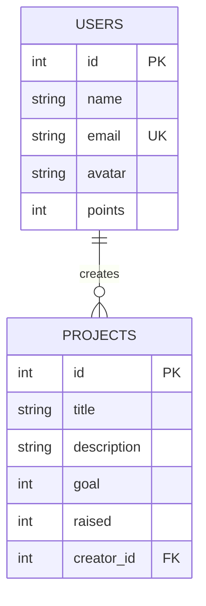

# Documentación Técnica - Impact Hub 2026

Este documento contiene las respuestas y evidencias necesarias para el Examen 2 de Aplicaciones Web.

## 1. Organización MVC (Modelo-Vista-Controlador)

El proyecto sigue una arquitectura desacoplada moderna que separa claramente las responsabilidades:

- **Modelo (Model):** Ubicado en `src/db/schema.ts`. Define la estructura de los datos (tablas `users` y `projects`) y las relaciones entre ellas utilizando Drizzle ORM.
- **Vista (View):** Ubicada en `src/pages/` (ej. `HomePage.jsx`, `ProyectosPage.jsx`). Utiliza React y Tailwind CSS para renderizar la interfaz de usuario de forma reactiva.
- **Controlador (Controller):** Ubicado en `netlify/functions/api.ts`. Utiliza el framework Hono para gestionar las rutas de la API, procesar las peticiones HTTP y comunicarse con el Modelo (Base de Datos) antes de enviar una respuesta a la Vista.

---

## 2. Justificación Técnica

### ¿Por qué se eligió este lenguaje/entorno?
Se utilizó **JavaScript/TypeScript** con el ecosistema de **Node.js** (Hono) porque permite una integración fluida con React en el frontend. La elección de un entorno **Serverless (Netlify Functions)** permite que la aplicación escale automáticamente y sea económica de mantener, ya que solo consume recursos cuando se recibe una petición.

### ¿Dónde ocurre el procesamiento?
El procesamiento ocurre en ambos lados (**Híbrido**):
- **Cliente (Navegador):** El renderizado de la interfaz, el filtrado de proyectos en tiempo real y la gestión del estado visual (Modo Oscuro) ocurren en el navegador del usuario para una respuesta instantánea.
- **Servidor (Netlify/Neon DB):** La autenticación de usuarios, la persistencia de datos y las consultas complejas a la base de datos ocurren en las funciones serverless y en la base de datos Neon, garantizando la seguridad y la integridad de la información.

### Ventajas de esta implementación
1. **Velocidad:** Vite y Hono son herramientas extremadamente ligeras y rápidas.
2. **Seguridad:** El uso de un ORM (Drizzle) evita ataques de inyección SQL.
3. **Escalabilidad:** Al ser Serverless, no hay necesidad de gestionar servidores físicos o virtuales; la infraestructura de Netlify y Neon se encarga de todo.

---

## 3. Base de Datos (PostgreSQL)

### Modelo Relacional (ER Diagram)



### Script de Creación (SQL)

```sql
-- Creación de la tabla de Usuarios
CREATE TABLE users (
    id SERIAL PRIMARY KEY,
    name TEXT NOT NULL,
    email TEXT UNIQUE NOT NULL,
    avatar TEXT,
    points INTEGER DEFAULT 0
);

-- Creación de la tabla de Proyectos con Relación (FK)
CREATE TABLE projects (
    id SERIAL PRIMARY KEY,
    title TEXT NOT NULL,
    description TEXT NOT NULL,
    goal INTEGER NOT NULL,
    raised INTEGER DEFAULT 0,
    creator_id INTEGER REFERENCES users(id)
);

-- Inserción de datos de prueba (Mínimo 5 por tabla)
INSERT INTO users (name, email, points, avatar) VALUES 
('Eduardo Guerra', 'eduardo@hub.com', 5800, 'https://i.pravatar.cc/100?u=1'),
('Ana López', 'ana@causa.org', 4200, 'https://i.pravatar.cc/100?u=2'),
('Roberto Sanz', 'roberto@impacto.net', 1500, 'https://i.pravatar.cc/100?u=3'),
('Lucía Méndez', 'lucia@ong.com', 8900, 'https://i.pravatar.cc/100?u=4'),
('Carlos Ruiz', 'carlos@social.io', 3100, 'https://i.pravatar.cc/100?u=5');

INSERT INTO projects (title, description, goal, raised, creator_id) VALUES 
('Agua Limpia Global', 'Pozos de agua en zonas rurales.', 50000, 42500, 1),
('Escuelas Solares', 'Energía limpia para educación.', 35000, 25200, 1),
('Viviendas Resilientes', 'Construcción modular segura.', 120000, 69600, 2),
('Paneles Rurales', 'Kits solares para hogares.', 20000, 15600, 4),
('Reforestación Activa', 'Siembra de árboles nativos.', 50000, 27500, 5);

---

## 4. Consultas y Resultados

### Consulta 1: Obtener todos los proyectos con el nombre de su creador (Relación)
```sql
SELECT p.title, p.raised, u.name as creador
FROM projects p
JOIN users u ON p.creator_id = u.id;
```

### Consulta 2: Proyectos que han superado el 50% de su meta
```sql
SELECT title, raised, goal 
FROM projects 
WHERE raised > (goal / 2);
```

### Consulta 3: Top 3 usuarios con más Puntos de Impacto
```sql
SELECT name, points 
FROM users 
ORDER BY points DESC 
LIMIT 3;
```

---

## 5. Justificación del Diseño de Tablas
Se diseñaron estas dos tablas relacionadas para separar la entidad **Usuario** de la entidad **Proyecto**.
- La tabla `users` centraliza los datos de perfil y gamificación (puntos).
- La tabla `projects` almacena la información técnica y financiera de cada iniciativa.
- La relación **1:N (Uno a Muchos)** permite que un usuario pueda ser autor de múltiples proyectos, manteniendo la integridad referencial mediante una llave foránea (`creator_id`).

---

## 6. Conclusión Personal

### ¿Qué dificultades tuvo durante el proceso?
La principal dificultad fue la integración de la base de datos en tiempo real con funciones serverless de Netlify, asegurando que la conexión fuera rápida y segura sin necesidad de un servidor dedicado permanente. También la resolución de problemas de configuración en el archivo `package.json` para el despliegue automático.

### ¿Qué aprendió?
Aprendí a implementar una arquitectura Fullstack moderna utilizando frameworks ligeros como Hono y ORMs eficientes como Drizzle. También comprendí la importancia de separar las responsabilidades mediante el patrón MVC para facilitar el mantenimiento y la escalabilidad de aplicaciones web en la nube.
```
