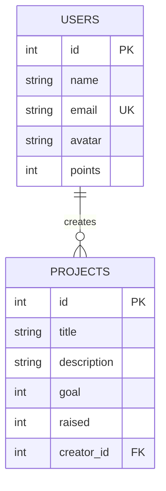

# Documentación Técnica - Impact Hub 2026

Este documento contiene las respuestas y evidencias necesarias para el Examen 2 de Aplicaciones Web.

## 1. Organización MVC (Modelo-Vista-Controlador)

El proyecto sigue una arquitectura desacoplada moderna que separa claramente las responsabilidades:

- **Modelo (Model):** Ubicado en `src/db/schema.ts`. Define la estructura de los datos (tablas `users` y `projects`) y las relaciones entre ellas utilizando Drizzle ORM.
- **Vista (View):** Ubicada en `src/pages/` (ej. `HomePage.jsx`, `ProyectosPage.jsx`). Utiliza React y Tailwind CSS para renderizar la interfaz de usuario de forma reactiva.
- **Controlador (Controller):** Ubicado en `netlify/functions/api.ts`. Utiliza el framework Hono para gestionar las rutas de la API, procesar las peticiones HTTP y comunicarse con el Modelo (Base de Datos) antes de enviar una respuesta a la Vista.

---

## 2. Justificación Técnica

### ¿Por qué se eligió este lenguaje/entorno?
Se utilizó **JavaScript/TypeScript** con el ecosistema de **Node.js** (Hono) porque permite una integración fluida con React en el frontend. La elección de un entorno **Serverless (Netlify Functions)** permite que la aplicación escale automáticamente y sea económica de mantener, ya que solo consume recursos cuando se recibe una petición.

### ¿Dónde ocurre el procesamiento?
El procesamiento ocurre en ambos lados (**Híbrido**):
- **Cliente (Navegador):** El renderizado de la interfaz, el filtrado de proyectos en tiempo real y la gestión del estado visual (Modo Oscuro) ocurren en el navegador del usuario para una respuesta instantánea.
- **Servidor (Netlify/Neon DB):** La autenticación de usuarios, la persistencia de datos y las consultas complejas a la base de datos ocurren en las funciones serverless y en la base de datos Neon, garantizando la seguridad y la integridad de la información.

### Ventajas de esta implementación
1. **Velocidad:** Vite y Hono son herramientas extremadamente ligeras y rápidas.
2. **Seguridad:** El uso de un ORM (Drizzle) evita ataques de inyección SQL.
3. **Escalabilidad:** Al ser Serverless, no hay necesidad de gestionar servidores físicos o virtuales; la infraestructura de Netlify y Neon se encarga de todo.

---

## 3. Base de Datos (PostgreSQL)

### Modelo Relacional (ER Diagram)



### Script de Creación (SQL)

```sql
-- Creación de la tabla de Usuarios
CREATE TABLE users (
    id SERIAL PRIMARY KEY,
    name TEXT NOT NULL,
    email TEXT UNIQUE NOT NULL,
    avatar TEXT,
    points INTEGER DEFAULT 0
);

-- Creación de la tabla de Proyectos con Relación (FK)
CREATE TABLE projects (
    id SERIAL PRIMARY KEY,
    title TEXT NOT NULL,
    description TEXT NOT NULL,
    goal INTEGER NOT NULL,
    raised INTEGER DEFAULT 0,
    creator_id INTEGER REFERENCES users(id)
);

-- Inserción de datos de prueba
INSERT INTO users (name, email, points) VALUES ('Eduardo', 'eduardo@ejemplo.com', 5800);
```
